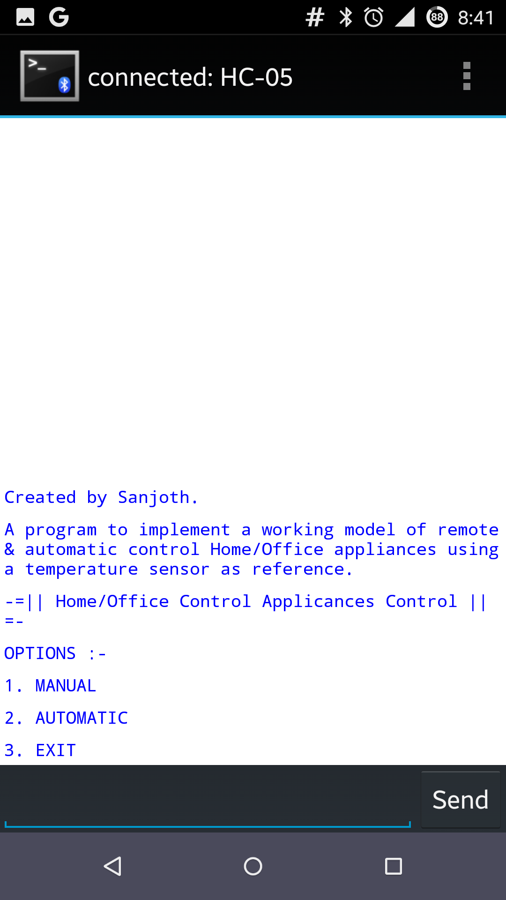

#  Ambient Weather Monitor
### Department	of	Computer	Science	and	Engineering, Sharda University
### Tinkering Lab – 2nd	Year
#### Mentor:	Prof.	Ishan	Ranjan (Head of Department, CSE)
#### December,	2015

---
## ACKNOWLEDGEMENT
Working on this project on Internet of Things was a source of immense knowledge to me. I would like express my sincere gratitude to Prof. Ishan Ranjan for his guidance and valuable support throughout the course of this project work. I acknowledge with deep sense of gratitude, the encouragement and inspiration received from my faculty members and colleagues. I would also like to thank my friends for helping and supporting throughout the preparation of this project work. Altogether, it was a great experience.

## SUMMARY

The Internet of Things (IoT) is the network of physical objects (devices, vehicles, buildings and other items) embedded with electronics, software, sensors, and network connectivity that enables these objects to collect and exchange data.

An Arduino Uno board will be used as a programmable interface which will be used to send & receive data. We will be using a Bluetooth HC-05 Module to trigger any electronic device connected to any of the output ports of the Uno Board and a temperature sensor to control the on/off signals automatically when an increase in temperature is found.

There is an option of choosing automatic control or remote control of the device. We can use our mobile phones, laptops, any device that has a Bluetooth adapter to pair with the HC-05 module and control it. If automatic control is selected, the temperature reading from a LM35(Reference) sensor will control the on/off signal to be send to the devices.

## REQUIREMENTS
### Hardware Prerequisites
• Arduino Uno R3 Board (1)
• Temperature Sensor LM-35 (1)
• Bluetooth HC05 Module (1)
• SMPS Adapter 1A (1)
• LED (1)
• Philips Hair Dryer (1)
• Connecting Wires (12)

### Software Prerequisites
• Bluetooth Terminal or Android App using Bluetooth as Source
• Bluetooth Connectivity in Arduino & Device
    
## WORKING
    • The HC05 Bluetooth module and the LM35 sensor will be connected to the input of the Arduino Uno Board and any electronic component to its output.
    • For manual, we pair our device to the Bluetooth Module(HC-05) attached to the Arduino board.
    •  To turn on or off the component in the output , send the command “a” or “b” respectively from the device having Bluetooth adapter say Phone, Laptop etc using a Bluetooth terminal.
    • The Bluetooth module HC-05 will then read the data sent and send the analog HIGH or LOW signal to the device connected to the output of the Arduino.
    • For automatic control, we takeLM35 sensor as reference, which will send a HIGH signal to the Uno interface to turn on the device depending upon the ambient temperature.

## A FEW REAL WORLD APPLICATIONS
    • Controlling all devices in an area wirelessly using 1 device.
    • Home/Office Automation
    • Model for Huge Power Savings by just a button press.
    • Personal Area Network(PAN) :  You have the option of using Home network rather than the whole Internet to ensure more security, so that no one can have unauthorized Access.
    
## OUTPUTS

